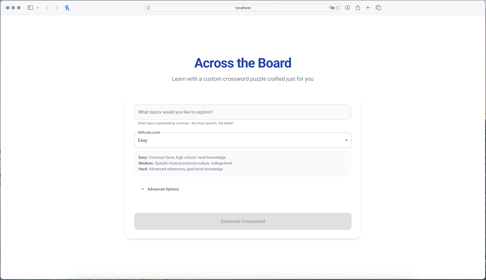
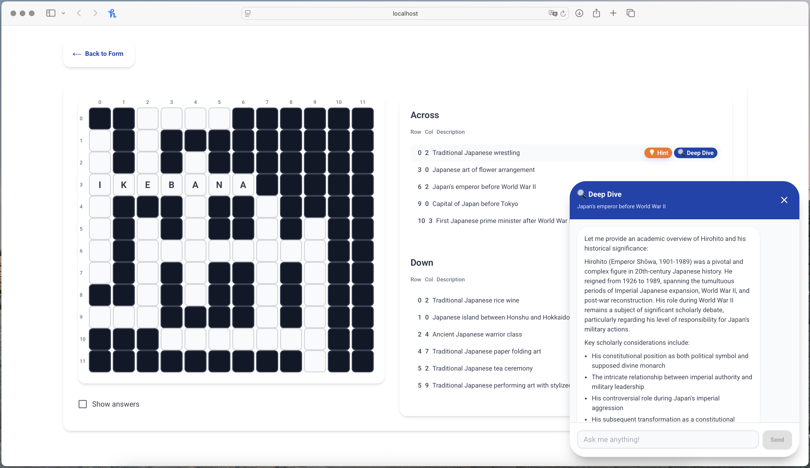
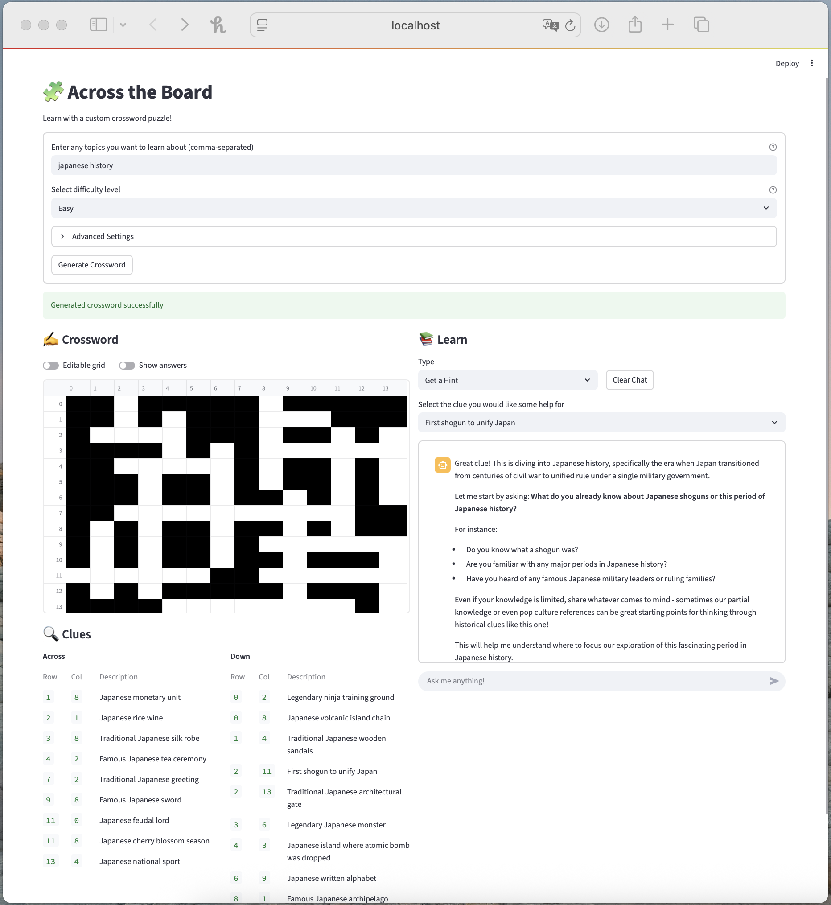

# Across the Board 

Personalized crosswords auto-generated for your interests to spur your memory and mental acuity - across topics & across the crossword board. 

🚀 Built during a **quick sprint** - exploratory, intentionally incomplete

### Features

- **Customizable results**: input specific topics of interest and a clue difficulty level
- **Interactive play**: fill in answers directly and check your answers in-app 
- **Smart hints**: leverage LLMs to help you ideate and extend your memory & thought-process
- **Deep dives**: explore facts further with built-in research + LLM Q&A

<p align="center">
  
</p>

<p align="center">
  
</p>

An initial app prototype was built in Streamlit as shown below
<p align="center">
  
</p>

## Running It Locally

1. Run `make init-workspace`
2. Run `make run-react` to run the React app and API (Served at `http://localhost:3001`)
3. Run `make run-streamlit` to run the Streamlit app and API (Served at `http://localhost:8501`)

This will automatically start:
- Weaviate vector database
- FastAPI backend server (with Swagger UI at `http://localhost:8000/docs`)
- Streamlit or React frontend

> **Note**: The NYT clue embeddings corpus is not included in this repository due to GitHub size limits. The app will still run without this dataset.

## Problem

Off of the viral MIT research paper ["Your Brain on ChatGPT: Accumulation of Cognitive Debt when Using an AI Assistant for Essay Writing Task"](https://arxiv.org/pdf/2506.08872) I've become more aware of the impact that leveraging GenAI has on our cognitive engagement. These MIT researchers found that using LLMs for essay writing resulted in **weaker neural connectivity** compared to "brain-only" writing. Worse, those effects lingered even after the AI use stopped. 

At the same time, I have personally seen how LLMs and Generative AI can be used to broaden my knowledge base and enhance my productivity. 

How could we leverage Generative AI to provoke (instead of replace) thinking and increase our cognitive engagement? 

## Solution

*Not really a "solution", more of a fun potential mitigant to the broader problem.* 

Recently, I've gotten into crosswords. They are a fun way for me to use my memory and learn new facts about the world. 

It's backed by research as well - mild cognitive impairment (MCI) research has shown that people who did crossword training actually improved their scores on standard Alzheimer's cognitive tests, compared to those who played generic computer games. ["Computerized Games versus Crosswords Training in Mild Cognitive Impairment"](https://evidence.nejm.org/doi/10.1056/EVIDoa2200121) found that crosswords improved cognition on par with FDA-approved memoy enhancing medication. 

Crosswords may be more than just a fun pastime - a genuine tool for brain health. 

So - what if we engaged crosswords - but leveraged generative AI to tailor it to your interests? You're not just solving filler trivia, but actively recalling, connecting, and stretching your brain on topics you care about. 

### Existing Approaches 

When quickly scanning existing sites and platforms to create your own crossword, I immediately found 3 gaps:

1. **They were relatively elementary puzzles** - few harder than a NYT Monday and some of the "AI-powered" ones had issues with their construction.
2. **They spoil the challenge** -- creators of a crossword see the answers right away. 
3. **They lacked the sparkle** -- missing the playful cleverness and wit of professional crossword constructors.  

### My Approach 

Without overengineering and trying to re-invent crossword creating and building (softwares which already exist), I wanted to build a fast, tightly scoped prototype that would smartly integrate LLMs where they shine - topic selection, clue generation, and Q&A. 

**Considerations**
- Time boxed to <12 hours (1 day)
- More engaging grids with interesting clues than online offerings
- Scoped realistically (smaller grid like [this]("https://upload.wikimedia.org/wikipedia/commons/thumb/1/14/CrosswordUSA.svg/1200px-CrosswordUSA.svg.png") not a [NYT Sunday]("https://www.dictionary.com/e/wp-content/uploads/2020/04/20200414_crossword_1000x700.jpg"))
  - Denser is better, without going deep into the crossword fill algorithm
- Reuse existing resources like ["century-arcade/xd"](https://github.com/century-arcade/xd) and ["Crossword Constructor Resource Guide (NYT)"](https://www.nytimes.com/2021/11/08/crosswords/crossword-constructor-resource-guide.html)

## Technical Design 

This prototype demonstrates how embeddings, LLMs, and a simple crossword generator can be combined into an interactive learning tool.

### Architecture Overview
```
┌─────────────────┐     HTTP Requests     ┌─────────────────┐
│     React       │ ────────────────────► │    FastAPI      │
│   Frontend      │                       │    Backend      │
│   (Port 3001)   │ ◄──────────────────── │   (Port 8000)   │
└─────────────────┘     JSON Responses    └─────────────────┘
                                                    │
┌─────────────────┐     HTTP Requests               │
│   Streamlit     │ ────────────────────►           │
│   Frontend      │                                 │
│   (Port 8501)   │ ◄────────────────────           │
└─────────────────┘     JSON Responses              │
                                                    ▼
                                          ┌──────────────────┐
                                          │  Core Services   │
                                          │  • ClueGenerator │
                                          │  • ChatService   │
                                          │  • CrosswordGen  │
                                          └──────────────────┘
```

The application uses a FastAPI backend to expose core functionality as REST endpoints, providing separation of concerns, better scalability, and interactive API documentation. Two frontend options are available:

- **React App** (Next.js): Modern web interface built with Next.js, Material-UI, and TypeScript for enhanced user experience and interactivity
- **Streamlit App**: Rapid prototyping interface for quick development and testing

### Data & Embeddings

* Embedded **5K historical NYT crossword clues (2024–2025)** using **[Qwen/Qwen3-Embedding-0.6B](https://huggingface.co/Qwen)**
* Stored and queried via **Weaviate** vector database
* Embeddings retrieved to surface *similar clues* to user topics, guiding clue generation

### System Workflow

1. **User Input**: User inputs topics + selects difficulty level
2. **Clue Generation**
   * Similar clues pulled from vector DB
   * **Claude** tool calls produce structured crossword clues
3. **Crossword Generation**
   * Naive grid-filling algorithm:
     * Sort words by length (desc.)
     * Place longest word in center
     * Iteratively fit remaining words at intersections
     * Ensure valid overlaps (no butt-joins, all words from clue list)
4. **UI Rendering**: Two frontend options available:
   * **React App**: Modern Next.js interface with Material-UI components, TypeScript support, and enhanced crossword interaction
   * **Streamlit App**: Rapid prototyping interface for crossword play + session state mgmt
5. **LLM Features**
    * **Claude models** power:
      * *Deep Dive into Answer* (contextual exploration)
      * *Give Me a Hint* (guided support)

### Developer Tooling
  * **uv** for Python env management
  * **npm/yarn** for Node.js dependency management
  * **Next.js** for React framework and development server
  * **TypeScript** for type safety in React components
  * **Makefile** for build/test automation
  * **Docker Compose** for Weaviate
  * **ruff** + **pre-commit** for linting and style checks

## Next Steps

1. **Algorithm Research** – explore crossword construction methods (e.g. graph-based / clique problem approaches)
2. **Expand Data** – embed larger word lists + clue sets to improve crossword quality
3. **UI Improvements** – build richer crossword interface with robust word checking & editing
4. **Research Capabilities** - integrate web/data sources for news-driven clues & richer deep dives
5. **LLM Prompt Engineering** – refine prompts for clue generation, hints, and deep dives
